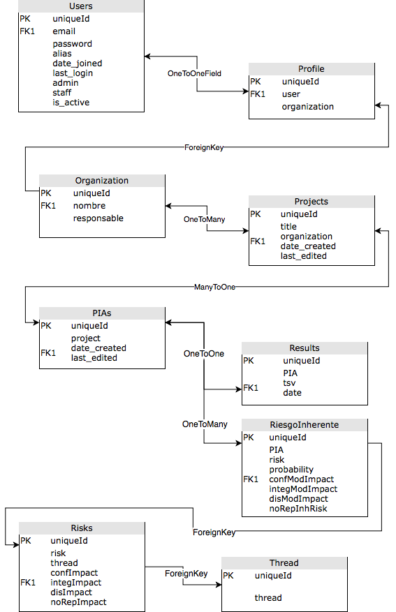

# PIA Toolkit 

### Abstract

The new General Regulation of Data Protection Directive (GDPR) encourages the realization of Privacy Impact Assessments (PIA) prior to the processing of personal data.  This type of study aims to minimize the impact that the materialization of a threat would have by focusing on the domain of Privacy. 
The proposal of this project presents a methodology that relates the impact of privacy threats in the security domains of Confidentiality, Integrity, Availability and Traceability, providing a unified analysis in the risk management process implemented.  
In order to respond to this requirement, the web application "PIA Toolkit" was developed using the Django web development framework. In addition, the application has been deployed on the technological infrastructure necessary to offer the service through the Internet, implementing certain measures that provide additional security protections. The source code has been released in a public repository with the expectation that the developer community can contribute to its improvement and implementation of new functionality.  
The results obtained from this project provide the industry with an analysis and integration methodology that has not been proposed until now. It is expected to serve as support and motivation for the execution of this type of study, which, through resulting improvements in adapting to user needs over time, will actively contribute to promoting privacy in the design stage phases of software development, and its consequent social benefit in terms of data protection.

Keywords: GDPR, PIA, Data Protection, Django
 
### Live App
The live PIA Toolkit web app can be found at [Safewave - PIA Toolkit](https://pia-manager.safewave.es)

Demo account ---> 
            User: guest@demo.com;
            Password: guest;

### Prerequisites

Django2.0 runs on Python 3.6, I suggest the use of virtualenv to avoid problems with the dependencies while deploying the app in your local host. The approach would be:

```
pip install virtualenv
```

And then ```create``` and ```activate``` your virtual environment to install all the dependencies in it.

If it's the first time you've heard about virtualenv visit  [virtualenv documentation](https://virtualenv.pypa.io/en/stable/installation/)

Django filetransfers needs to be installed from the ```wkornewald-django-filetransfers-b2df8b4fbf2e``` directory included in the root folder of the project.
This package comes from  [Django-filetransfers](https://bitbucket.org/wkornewald/django-filetransfers)
Then go into the downloaded folder and install with:

```
python setup.py install
```

You can use [pip](https://pypi.org/project/pip/) for the installation of the rest of the packages and dependences included on the ```requirements.txt``` file,
  
```
pip install -r requirements.txt
```

### Running the webApp

Once installed all the dependencies navigate to the root folder of the project, apply the migrations to generate the local database:

```
python manage.py migrate
```

You may want to add a super user to have acces to the admin panel,

```
python manage.py createsuperuser
```

Bear in mind that the project is using django-admin-honeypot, so the real admin panel by default will be on ```/secret``` instead.

And then run the Django Application with:

```
python manage.py runserver
```

Now PIA Toolkit will be running in the specified port of your local host.

## DB structure



## Deploying

The live version of this project was deployed using [AWS elasticbeanstalk](https://aws.amazon.com/es/elasticbeanstalk/) that is the reason why some dependencies as boto3 or django-ses are included. Same with AWS-related environment variables as ```RDS_DB_NAME ```.

Feel free to grab your own choice of Deployment platform!

## Authors

**m3d14n0** - [GitHub account](https://github.com/m3d14n0)

## License

This project is licensed under the MIT License - see the [LICENSE.md](LICENSE.md) file for details

